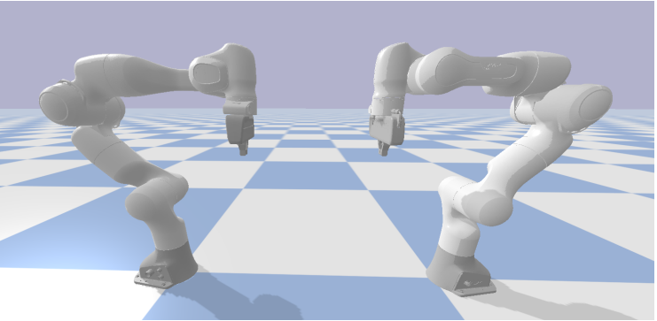

Franka Emika Panda
===============================

Introduction
-----------------
In this repository there is the control code to perform a bimanual manipulation by implementing the task priority algorithm considering two manipulators as a single robot. The manipulator adopted is the [Franka Panda by Emika](https://www.franka.de/), a versatile 7-DOF manipulator for researchers. Moreover, a simulation in python is provided, in order to visualize the two robots and test yours Matlab implementation.

System requirements and installation
-----------------
In the repository you will find the folder *bimanual_manipulation_exercise* in which you have the simulator and the matlab code. In order to be able to run the code you need to have:
* Matlab installed, version > 2019a with the following toolbox installed:  
– Robotic System Toolbox  
– DSP System Toolbox
* Ubuntu version > 18.04 (probably the simulator works with other distributions, but additional
installations of python packages may be required.):  
– python3 working  
– pyBullet installed  
* To check the correct functioning of your python environment on Ubuntu simply type in a shell:  
`python3 --version if a python version is retrieved the check is done, if not follows the guide:
https://phoenixnap.com/kb/how-to-install-python-3-ubuntu.`
* To install pyBullet simply digit in a shell: `pip install pybullet`.  
Consider the possibility of using a virtual machine for the simulator if you don’t have Ubuntu on your
PC. Matlab can run on windows since the data are sended to the simulation using UDP communication.  

The simulator
-----------------
In order to run the visualization of the bimanual system simply go to the root of the folder *bimanual_manipulation_exercise* and type in a shell 
```bash
python3 pybullet_simulation/franka_panda_simulation
```
to launch the simulator. A scene with two Franka Panda, the left Arm and the Right Arm will appear
    Rotate the camera by pressing ctrl+left_button while dragging the mouse, move the camera
by ctrl+Alt+left_button while dragging the mouse
